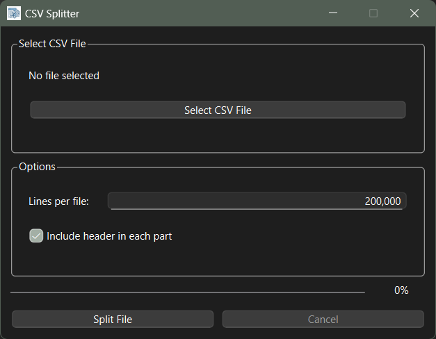

# CSV-Splitter
CSV Splitter is an open-source GUI tool for splitting large text-based files into smaller parts.


## Installation
Install the required Python dependencies with:

```
pip install -r requirements.txt
```

## Usage
Launch the graphical interface by running:

```
python csv-splitter.py
```

The application does not provide any command-line options. All interactions are performed through the GUI.

# Use PyInstaller to bundle app in Windows
```
pyinstaller csv-splitter.py --clean --noupx --noconsole --noconfirm --onefile --windowed --icon=app_icon.ico --add-data "app_icon.ico;."
```
