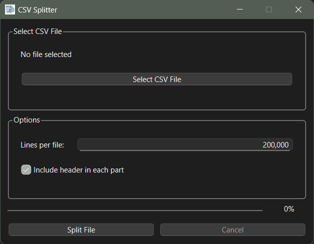

# CSV-Splitter
CSV Splitter is an open-source GUI tool for splitting large CSV and other text-based files into smaller, easier-to-open parts.

It is built for cases where a file is too large to work with comfortably in Microsoft Excel. Excel worksheets are limited to 1,048,576 rows, so splitting a large source file into smaller chunks helps keep each output file within a practical worksheet size.

## Screenshot


## Features
- Split CSV, TXT, XML, and other text-based files into numbered parts.
- Choose how many data lines should go into each output file.
- Optionally copy the source header row into every generated part.
- Use the desktop GUI without command-line options.

## Installation
Install the required Python dependencies with:

```
pip install -r requirements.txt
```

## Usage
Launch the graphical interface by running:

```
python csv-splitter.py
```

Set "Lines per file" below your target row limit. When "Include header in each part" is enabled, the header row is added to each output file in addition to the selected data-line count.

## Build a Windows executable
```
pyinstaller csv-splitter.py --clean --noupx --noconsole --noconfirm --onefile --windowed --icon=app_icon.ico --add-data "app_icon.ico;."
```

## Testing
Install pytest, then run the test suite:

```
pip install pytest
pytest -q
```

## License
This project is released under the MIT License.
